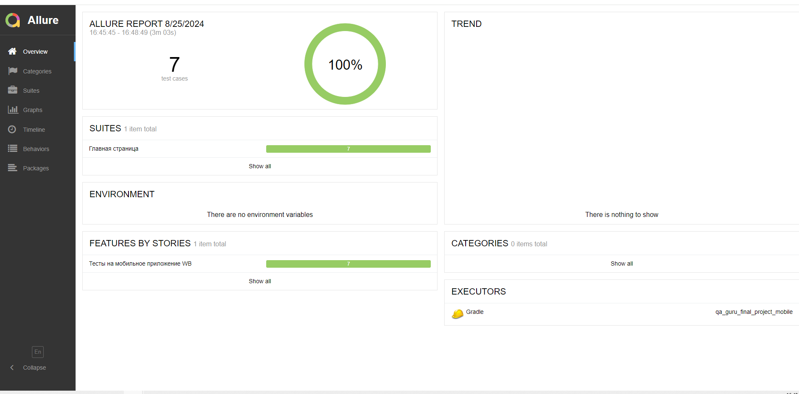

# Дипломный проект для qa_guru (MOBILE) [**wildberries**](https://www.x5.ru/)


## 	:world_map: Содержание:

- [Используемый стек](#computer-используемый-стек)
- [Описание автотестов](#pushpin-описание-тестов)
- [Запуск автотестов](#arrow_forward-запуск-автотестов)
- [Пример Allure-отчета](#-пример-allure-отчета)
- [Видео примера запуска тестов в Selenoid](#видео-примера-запуска-тестов-в-selenoid)

##  :computer: Используемый стек
<p align="center">


</p>

Тесты в данном проекте написаны на языке <code>Java</code> с использованием фреймворка для тестирования [Selenide](https://selenide.org/), сборщик - <code>Gradle</code>. <code>JUnit 5</code> задействован в качестве фреймворка модульного тестирования.
При прогоне тестов для запуска используется локальный эмулятор мобильного устройства
- src/test/resources/local.properties -  В данном файле содержатся данные для подключения

## :pushpin: Описание тестов:
- [x] *src/test/java/tests/MainTest - Сьют с тестами на главной странице*
  - *openCatalogTest - Тест на открытие каталогов с главной страницы*
  - *addProductInCart - Тест на добавление товара с главной страницы*
  - *searchTest - Тест на поиск с главной страницы*


Содержание Allure-отчета:
* Шаги теста;
* Скриншот страницы на последнем шаге;
* Page Source (возможность открыть source страницы в новой вкладке и посмотреть причину падения теста);


## :arrow_forward: Запуск автотестов

### Запуск тестов из терминала
Локальный запуск.
Из корневой директории проекта выполнить:


Для запуска API тестов

``` bash
gradle clean android
```


##  Пример Allure-отчета

<p align="center">

</p>


